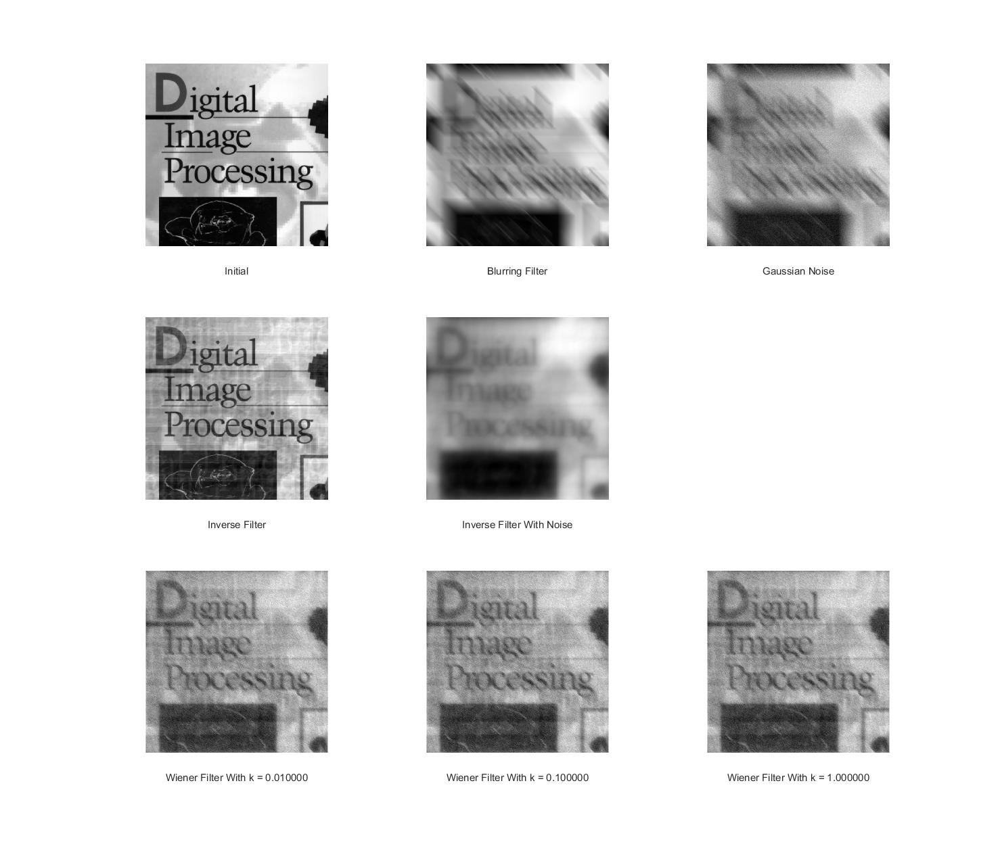

# Homework4
`jskyzero` `2017/12/26`

## Project 4：Image Restoration
> The scoring method for this project is as follows:
1. Implement a blurring filter using the equation (5.6-11，数字图像处理（第三版）) in textbook, and blur the test image ‘book_cover.jpg’ using parameters a=b=0.1 and T=1. (20%)

    按照教材上的公式计算H，其他的和之前的滤波基本上是一致的，需要注意的是，由于对傅里叶变换后的G我们移动到了屏幕中央，因此(u,v)的相对值也需要以屏幕中心为基准。另外也需要注意分母为零的情况。

2. Add Gaussian noise of 0 mean and variance of 500 to the blurred image. (10%)

    建一个高斯分布然后加性噪声即可，对于500的方差需要根据图像大小做一个单位化。

3. Restore the blurred image and the blurred noisy image using the inverse filter. (30%)

    这里需要注意(u,v)的设置需要延续第一问，毕竟是假定已经知道了退化方法。
    
    对于带有噪声的，我们需要先去噪，这里使用上此实验的Butterworth Filter，其余的处理都是类似的。

4. Restore the blurred noisy image using the parametric Wiener filter with at least 3 different parameters, and compare and analyse results with that of 3. (40%) 

    这里将实验了K属于[0.01, 0.1, 1]，效果都还是不错的，有一些细微的差别但是比较难描述，当K为零的时候，Wiener Filter其实也就退化成了Inverse Filter。

## 实验结果

