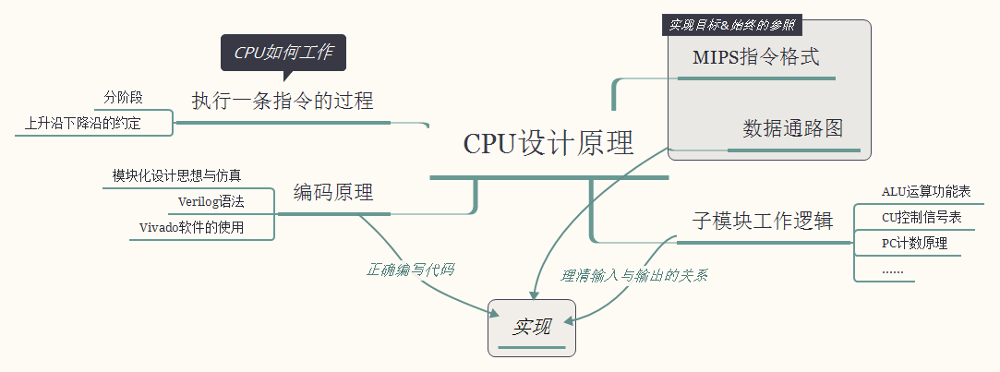
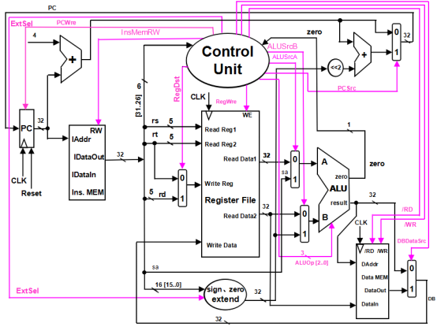

# 1.single_cycle_processor
`jskyzero` `2017/12/22`
> you can find the source code in CPU.srcs folder, open and see these codes.

## 设计原理

## CPU数据通路

## 指令含义

> 算术运算指令

（1）add  rd , rs, rt  （说明：以助记符表示，是汇编指令；以代码表示，是机器指令）

| 000000 | rs(5位) | rt(5位) | rd(5位) | reserved |
| ------ | ------ | ------ | ------ | -------- |
|        |        |        |        |          |

功能：rd←rs + rt。reserved为预留部分，即未用，一般填“0”。

（2）addi  rt , rs ,immediate  

| 000001 | rs(5位) | rt(5位) | immediate(16位) |
| ------ | ------ | ------ | ------------------ |
|        |        |        |                    |

功能：rt←rs + (sign-extend)immediate；immediate符号扩展再参加“加”运算。

​    （3）sub  rd , rs , rt

| 000010 | rs(5位) | rt(5位) | rd(5位) | reserved |
| ------ | ------ | ------ | ------ | -------- |
|        |        |        |        |          |

完成功能：rd←rs - rt

> 逻辑运算指令

（4）ori  rt , rs ,immediate  

| 010000 | rs(5位) | rt(5位) | immediate(16位) |
| ------ | ------ | ------ | ------------------ |
|        |        |        |                    |

功能：rt←rs | (zero-extend)immediate；immediate做“0”扩展再参加“或”运算。

（5）and  rd , rs , rt

| 010001 | rs(5位) | rt(5位) | rd(5位) | reserved |
| ------ | ------ | ------ | ------ | -------- |
|        |        |        |        |          |

功能：rd←rs & rt；逻辑与运算。

​    （6）or  rd , rs , rt

| 010010 | rs(5位) | rt(5位) | rd(5位) | reserved |
| ------ | ------ | ------ | ------ | -------- |
|        |        |        |        |          |

功能：rd←rs | rt；逻辑或运算。

 

> 移位指令

（7）sll  rd, rt,sa 

| 011000 | 未用   | rt(5位) | rd(5位) | sa   | reserved |
| ------ | ---- | ------ | ------ | ---- | -------- |
|        |      |        |        |      |          |

功能：rd<－rt<<(zero-extend)sa，左移sa位 ，(zero-extend)sa

 

> 存储器读/写指令

（8）sw  rt ,immediate(rs) 写存储器

| 100110 | rs(5位) | rt(5位) | immediate(16位) |
| ------ | ------ | ------ | ------------------ |
|        |        |        |                    |

​    功能：memory[rs+ (sign-extend)immediate]←rt；immediate符号扩展再相加。

（9) lw  rt , immediate(rs) 读存储器

| 100111 | rs(5位) | rt(5位) | immediate(16位) |
| ------ | ------ | ------ | ------------------ |
|        |        |        |                    |

功能：rt ← memory[rs + (sign-extend)immediate]；immediate符号扩展再相加。

 

> 分支指令

  （10）beq  rs,rt,immediate      

| 110000 | rs(5位) | rt(5位) | immediate(位移量，16位)>>2 |
| ------ | ------ | ------ | ------------------------- |
|        |        |        |                           |

功能：if(rs=rt) pc←pc + 4 + (sign-extend)immediate <<2  else pc ←pc + 4

特别说明：immediate是从PC+4地址开始和转移到的指令之间指令条数。immediate符号扩展之后左移2位再相加。为什么要左移2位？由于跳转到的指令地址肯定是4的倍数（每条指令占4个字节），最低两位是“00”，因此将immediate放进指令码中的时候，是右移了2位的，也就是以上说的“指令之间指令条数”。

 

> 停机指令

（11）halt 

| 111111 | 00000000000000000000000000(26位) |
| ------ | ------------------------------- |
|        |                                 |

功能：停机；不改变PC的值，PC保持不变。

## 指令和对应的二进制型号位 

| Ins  | opcode | zero | ALUsrcA | ALUsrcB | ALUop | RegWre | RegDst | InsMemRW | /RD  | /WR  | DBdataSrc | ExtSel | PCwre | PCsrc |
| ---- | ------ | ---- | ------- | ------- | ----- | ------ | ------ | -------- | ---- | ---- | --------- | ------ | ----- | ----- |
| add  | 000000 | x    | 0       | 0       | 000   | 1      | 1      | 0        | 1    | 1    | 0         | 0      | 1     | 0     |
| addi | 000001 | x    | 0       | 1       | 000   | 1      | 0      | 0        | 1    | 1    | 0         | 1      | 1     | 0     |
| sub  | 000010 | x    | 0       | 0       | 001   | 1      | 1      | 0        | 1    | 1    | 0         | 0      | 1     | 0     |
| or   | 010010 | x    | 0       | 0       | 100   | 1      | 1      | 0        | 1    | 1    | 0         | 0      | 1     | 0     |
| and  | 010001 | x    | 0       | 0       | 101   | 1      | 1      | 0        | 1    | 1    | 0         | 0      | 1     | 0     |
| ori  | 010000 | x    | 0       | 1       | 100   | 1      | 0      | 0        | 1    | 1    | 0         | 0      | 1     | 0     |
| sll  | 011000 | x    | 1       | 0       | 011   | 1      | 1      | 0        | 1    | 1    | 0         | 0      | 1     | 0     |
| sw   | 100110 | x    | 0       | 1       | 000   | 0      | 0      | 0        | 1    | 0    | 0         | 1      | 1     | 0     |
| lw   | 100111 | x    | 0       | 1       | 000   | 1      | 0      | 0        | 0    | 1    | 1         | 1      | 1     | 0     |
| beq  | 110000 | 0    | 0       | 0       | 010   | 0      | 0      | 0        | 1    | 1    | 0         | 1      | 1     | 1     |
| beq  | 110000 | 1    | 0       | 0       | 010   | 0      | 0      | 0        | 1    | 1    | 0         | 0      | 1     | 0     |
| halt | 111111 | x    | 0       | 0       | 111   | 0      | 0      | 0        | 1    | 1    | 0         | 0      | 0     | 0     |