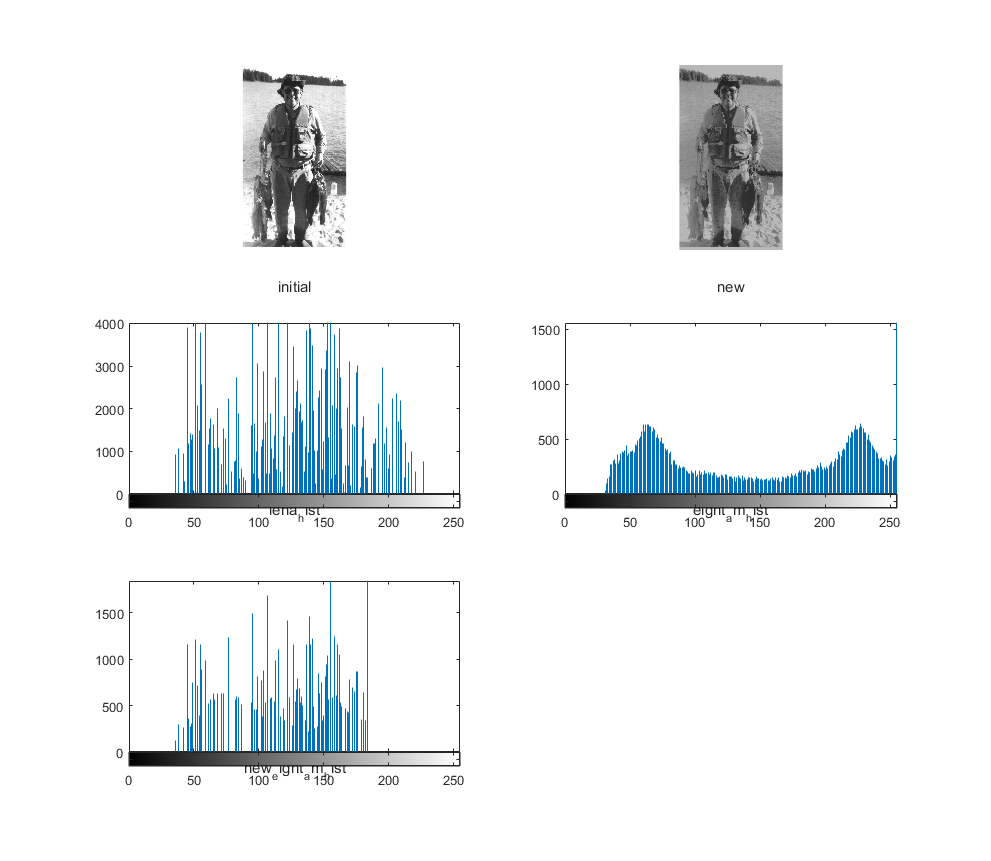

# Homework1
`jskyzero` `2017/10/09`

## 要求
> 1. 实现river.jpg图像的直方图均衡，不能直接使用Matlab的histeq()函数。将有关均衡图像和调用histeq()函数的结果作比较。
> 
> 2. 将图像EightAM.png的直方图匹配为图像LENA.png的直方图，显示 EightAM.png在直方图匹配前后的图像，并绘制LENA.png的直方图、直方图匹配前后EightAM.png的直方图，检查直方图匹配的效果。
> 
>  三个部分，算法描述和文档、代码和有关图像和直方图

## 过程

实验一只做一个简单的匹配就好了，结果如图

实验二花了很长时间在写公共函数上，结果如图
