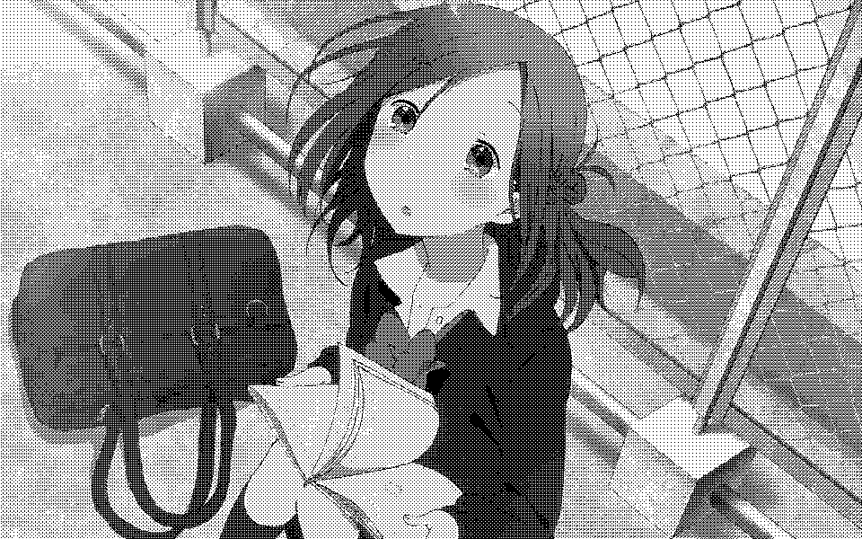

# 图像抖动

`2017/09/28` `多媒体技术`

## 介绍图像抖动的背景

对于报刊出版等领域，色彩空间相对我们的计算机RGB各8位的色彩空间是相当有限的，在此情况下，如何较好的表现出图像灰度的变化，使得图像更贴近真实？

原始的域值法，模式有限的模式法，具有代表性的误差分析法，这些都是图像抖动的方法。

关于[数字信号处理领域的抖动](https://zh.wikipedia.org/wiki/%E6%8A%96%E5%8B%95_(%E6%95%B8%E4%BD%8D%E8%A8%8A%E8%99%9F%E8%99%95%E7%90%86))是大有可谈的，本质上是引入噪声来降低原本某些误差的影响。

## 回顾不少于3篇的图像抖动的文章，介绍其方法

> 以下列出文章参考链接取自中国知网

+ [图像抖动技术的原理及实现 何志强](http://kns.cnki.net/KCMS/detail/detail.aspx?dbcode=CJFQ&dbname=CJFD9899&filename=XTYY199907014&uid=WEEvREcwSlJHSldRa1Fhb09jMjQyNUcrUUVQclQ1UStyUkdXL2UzNit4ND0=$9A4hF_YAuvQ5obgVAqNKPCYcEjKensW4ggI8Fm4gTkoUKaID8j8gFw!!&v=MTYzNDBlWDFMdXhZUzdEaDFUM3FUcldNMUZyQ1VSTDJmYnVSbkZ5SGxVNzNLUFRuU2Q3S3hGOWpNcUk5RVlJUjg=) 该文介绍了阈值法/模式法/抖动原理，并扩展到彩色空间。

+ [图像抖动中的Stucki滤波器方法 王玉增](http://kns.cnki.net/KCMS/detail/detail.aspx?dbcode=CJFQ&dbname=CJFD9697&filename=JSJS199602001&uid=WEEvREcwSlJHSldRa1Fhb09jMjQyNUcrUUVQclQ1UStyUkdXL2UzNit4ND0=$9A4hF_YAuvQ5obgVAqNKPCYcEjKensW4ggI8Fm4gTkoUKaID8j8gFw!!&v=MTQyOTk4ZVgxTHV4WVM3RGgxVDNxVHJXTTFGckNVUkwyZmJ1Um5GeUhsVTczSkx6N0JmYkt4RjlmTXJZOUZaWVI=) 该文详细介绍了误差分散法中的Stucki滤波器方法

+ [在16色模式下显示256色及全彩色 盛龙](http://kns.cnki.net/KCMS/detail/detail.aspx?dbcode=CJFQ&dbname=CJFD9495&filename=WDNJ199501011&uid=WEEvREcwSlJHSldRa1Fhb09jMjQyNUcrUUVQclQ1UStyUkdXL2UzNit4ND0=$9A4hF_YAuvQ5obgVAqNKPCYcEjKensW4ggI8Fm4gTkoUKaID8j8gFw!!&v=MjAxODNMdXhZUzdEaDFUM3FUcldNMUZyQ1VSTDJmYnVSbkZ5SG1WYjdJTWluRlpMS3hGOVRNcm85RVpZUjhlWDE=) 该文描述了16色模式下利用抖动显示256色图像的抖动算法


按照课程教案中的描述，图像抖动的主要策略是用一个大的模式来代替像素值，使图像较好的保持原先的颜色变化特征。

## 重点介绍一种灰度图像抖动方法和彩色图像抖动方法

这里介绍一种简单的有序抖动的方法，概括来说就是使用特定的抖动矩阵，使用该矩阵扫描原图片，并修改原图片对应的像素值（在只有黑白两种颜色时就是变为代表黑白的0/1）。

伪代码如下

```shell
BEGIN 
  for x = 0 to xmax // columns 
    for y = 0 to ymax // rows
      i = xmod n 
      j = ymod n 
      // I(x, y) is the input, O(x, y) is the output, 
      // D is the dither matrix. 
      if I(x, y) > D(i, j) 
        O(x, y) = 1;
      else 
        O(x, y) = 0; 
END
```

彩色图像和灰度图像本质上是一样的，如果要不需要保留彩色性可以直接就也给转成二值，需要保留的话，在矩阵判断的时候每一维颜色都保留下允许有的彩色信息。

## 实验关键代码（灰度图像抖动和彩色图像抖动关键代码）
```Python
for w in range(0, width):
  for h in range(0, height):
    i = w % N
    j = h % N
    Input = im.getpixel((w, h)) // 16
    if Input > Dither[i][j]:
      Output = 255
    else:
      Output = 0
    im.putpixel((w,h), Output)
```

彩色和黑白几乎没有区别，只是要对RGB三色每一维都保留对应分色。

```python
for w in range(0, width):
  for h in range(0, height):
    i = w % N
    j = h % N
    Input = im.getpixel((w, h))
    Output = [0, 0, 0, 255]
    for x in range(0, 3):
      if Input[x] // 16 > Dither[i][j]:
        Output[x] = 255
      else:
        Output[x] = 0
      im.putpixel((w,h), tuple(Output))
```


## 实验结果（灰度图像和彩色图像抖动）




## 总结

本次实验亲手实践了图像抖动，深刻理解了图像抖动的底层原理，在实现的时候选择了Python的pillow，总体来说并没有太大的麻烦，图像抖动本质上就是在色彩空间不足的时候如何尽可能的保留图片的信息，选择的介绍的抖动方法是比较单纯简单的，在查阅参考论文中也看到很多更加复杂的方法，看起来很小的一件事情也蕴含着很多知识。

## 参考

- [图像抖动技术的原理及实现 何志强](http://kns.cnki.net/KCMS/detail/detail.aspx?dbcode=CJFQ&dbname=CJFD9899&filename=XTYY199907014&uid=WEEvREcwSlJHSldRa1Fhb09jMjQyNUcrUUVQclQ1UStyUkdXL2UzNit4ND0=$9A4hF_YAuvQ5obgVAqNKPCYcEjKensW4ggI8Fm4gTkoUKaID8j8gFw!!&v=MTYzNDBlWDFMdXhZUzdEaDFUM3FUcldNMUZyQ1VSTDJmYnVSbkZ5SGxVNzNLUFRuU2Q3S3hGOWpNcUk5RVlJUjg=) 
- [图像抖动中的Stucki滤波器方法 王玉增](http://kns.cnki.net/KCMS/detail/detail.aspx?dbcode=CJFQ&dbname=CJFD9697&filename=JSJS199602001&uid=WEEvREcwSlJHSldRa1Fhb09jMjQyNUcrUUVQclQ1UStyUkdXL2UzNit4ND0=$9A4hF_YAuvQ5obgVAqNKPCYcEjKensW4ggI8Fm4gTkoUKaID8j8gFw!!&v=MTQyOTk4ZVgxTHV4WVM3RGgxVDNxVHJXTTFGckNVUkwyZmJ1Um5GeUhsVTczSkx6N0JmYkt4RjlmTXJZOUZaWVI=) 
- [在16色模式下显示256色及全彩色 盛龙](http://kns.cnki.net/KCMS/detail/detail.aspx?dbcode=CJFQ&dbname=CJFD9495&filename=WDNJ199501011&uid=WEEvREcwSlJHSldRa1Fhb09jMjQyNUcrUUVQclQ1UStyUkdXL2UzNit4ND0=$9A4hF_YAuvQ5obgVAqNKPCYcEjKensW4ggI8Fm4gTkoUKaID8j8gFw!!&v=MjAxODNMdXhZUzdEaDFUM3FUcldNMUZyQ1VSTDJmYnVSbkZ5SG1WYjdJTWluRlpMS3hGOVRNcm85RVpZUjhlWDE=) 
- [Pillow (PIL Fork)](http://pillow-zh-cn.readthedocs.io/zh_CN/latest/index.html)