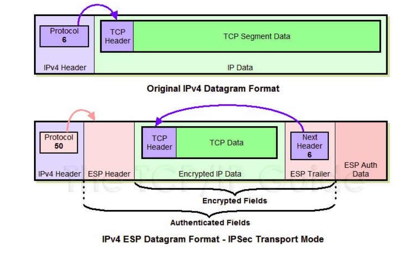

IPsec, Internet Protocol Security, is officially specified by IETF.

## Introduction

+ IPsec is an end-to-end security scheme.
+ IPsec protects any application traffic across an IP network.
+ AH Protocol & ESP Protocol / Tunnel Mode & Transport Mode

## ESP 报文 + 传输模式下

ESP: 可以对数据进行加密和完整性校验，是单独的一种网络层协议。

传输模式：区别于隧道模式，会保持之前的IP头（只修改部分重要信息。）

### 装包

1. 添加ESP trailer(包括填充/填充长度和记录原有网络层协议类型的Next header)
2. 整体（原有IP数据和添加的尾部）加密
3. 添加ESP Header（新的网络层协议头，里面有SPI/Seq#）
4. 在尾部附加完整性度量结果（ICV）
5. 更新IP header（更新数据长度等需要修改的字段）

### 拆包

1. 读取ESP头，使用SPI 确定SA。
2. 计算MAC，检验是否出错。
3. 检查次序码，丢弃不在范围的包，防止重放攻击。
4. 以上全部无误，开始解密。
5. 读取尾部信息，去除填充。
6. 取出原始数据报。