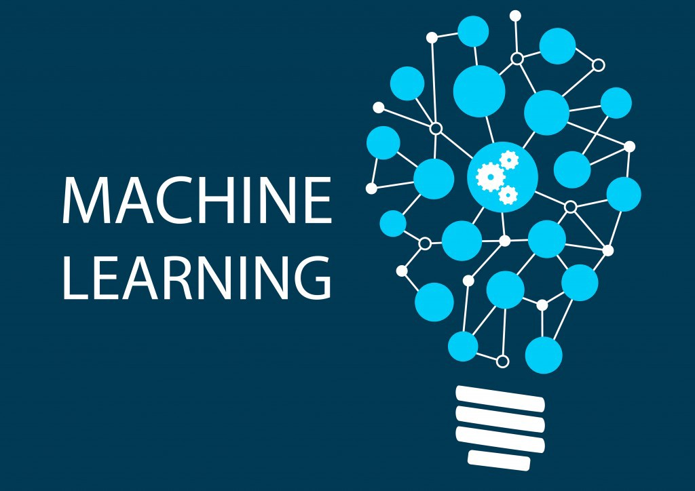

# Machine-Learning
`jskyzero` `2018/03/07`

## Overview

+ 机器学习通过学习以往的经验（或者说，数据），来优化程序的性能。
+ 机器学习是实现人工智能的一种途径。
+ 机器学习如今已经成为了一门多领域交叉的学科（诸多数学相关学科）。

## Structure

## Reference

- [PowerPoint](http://www.xieguotian.cn)
- 周志华. 机器学习. 清华大学出版社, 2016.
- Many Reference books
  + Jure Leskovec, Anand Rajaraman, Jeffrey David Ullman. Mining of Massive Datasets, Second Edition. Cambridge University Press, 2014. 
  + Pang-Ning Tan, Michael Steinbach, Vipin Kumar. Introduction to data mining. Pearson, 2006. 
  + T. Hastie, R. Tibshirani, and J. Friedman. The Elements of Statistical Learning: Data Mining, Inference, and Prediction, 2nd Ed. Springer, 2009. 

