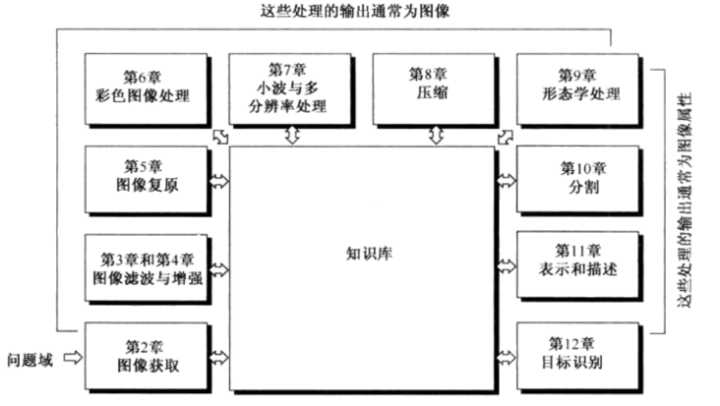

# Digit Image Propressing
`jskyzero` `2017/10/22`

上图为直方图均衡/匹配的输出图像。

## Overview

+ 关于数字图像。

  

+ 关于MATLAB

  多看参考多动手。

## REFERENCE

[MathWorks Docs China](https://cn.mathworks.com/help/)

[A Quick Tutorial on MATLAB](http://web.eecs.umich.edu/~aey/eecs451/matlab.pdf)