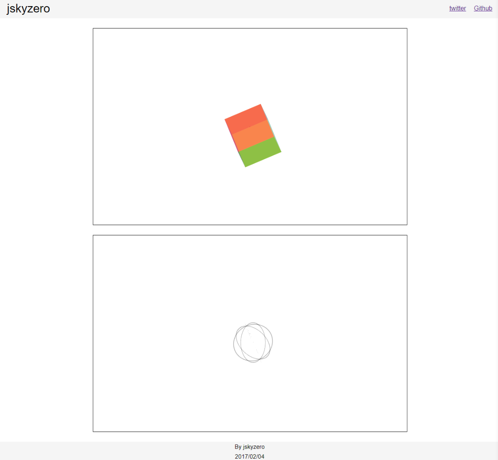

# CSS3-3D-Object
`jskyzero` `2017/02/06`

Some really cool css 3d effects

## Overview

Just use `transform-style: preserve-3d;` and add a parent set `perspective: 800px;` You can see some reference in the end.

## More Preview

Visit [Demo](https://jskyzero.github.io/SYSU-Software-Engineering/web/projects/CSS3-3D-Object/)

## Reference

[使用 CSS 实现的一些酷炫效果。](https://github.com/chokcoco/css3-)