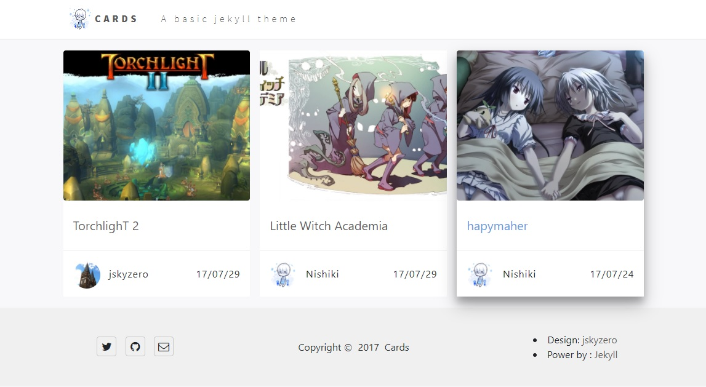

# Jekyll-Theme-Cards
`jskyzero` `2017/08/05` `jekyll`

## Features

1. Use many delicate cards in index page
2. Simple but quite useful

## How to use

Just use like common jekyll theme, you can clone it and run `jekyll serve`, if you need more info, please go jekyll docs for help.

If you want use bundle, just copy the gems folder's files to your folder, then make changes if you need, because I use the index.html so you must copy the files by hand.

## Projects
- [x] As a basic Theme
- [x] Finished HTML part
- [x] Finished CSS part
- [x] add JavaScrpt part ( In fact the javascript file is empty

- [x] add bootstrp v4